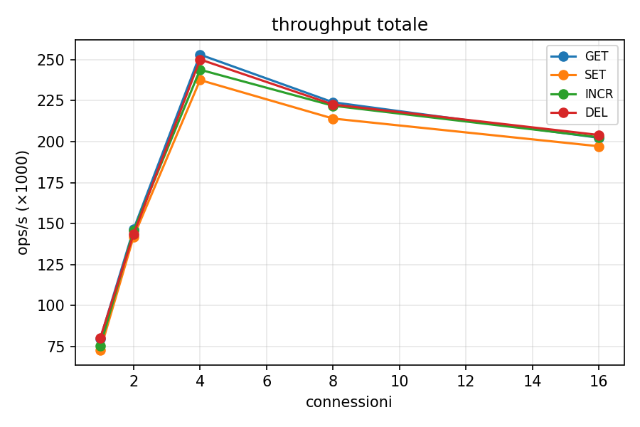
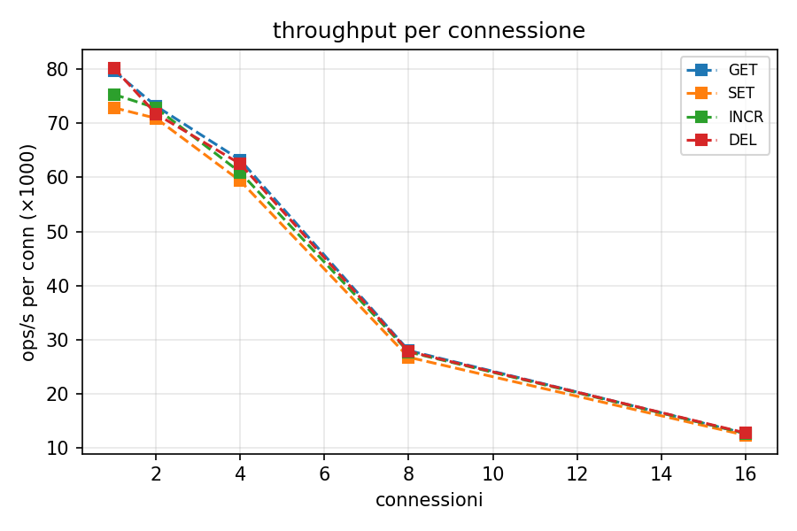
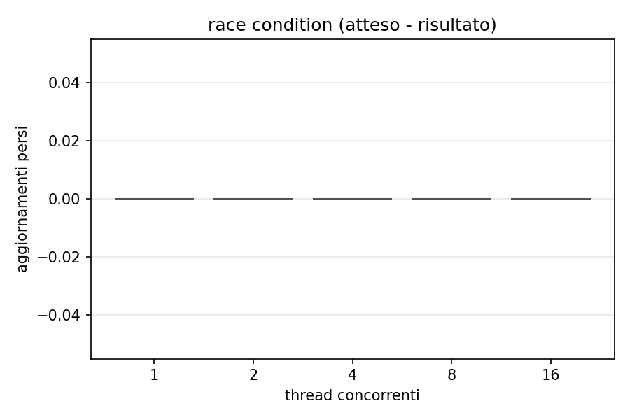

# MinRedis

A Redis-inspired in-memory key-value server written from scratch in C. The project explores TCP servers, concurrent clients, hash tables, persistence and quantitative performance analysis without relying on Redis internals.

## Highlights

- TCP server with a dedicated POSIX thread for each connected client.
- Sixteen logical databases selected independently by each connection.
- Hash-table storage protected by per-bucket read-write locks.
- Atomic read-modify-write handling for `INCR` under concurrent load.
- Versioned binary snapshots with manual and periodic save support.
- Incremental socket buffering that handles commands split across multiple TCP packets.
- Unit tests, race tests, throughput benchmarks and Valgrind integration.

## Protocol and commands

MinRedis accepts Redis-style inline commands terminated by `\r\n` and serialises replies using RESP types. It does not currently parse the full RESP array format used by standard Redis clients.

| Command | Purpose | Example reply |
|---|---|---|
| `SET key value` | Create or replace a string value | `+OK` |
| `GET key` | Read a value | `$5\r\nvalue\r\n` |
| `DEL key` | Delete a key | `:1` |
| `INCR key` | Atomically increment an integer | `:42` |
| `SELECT 0` | Select one of 16 databases | `+OK` |
| `INFO` | Return server and database statistics | RESP bulk string |
| `SAVE [path]` | Write a binary snapshot | `+OK` |
| `LOAD [path]` | Restore a binary snapshot | `+OK` |
| `QUIT` | Close the connection | `+OK` |

## Build

Requirements: a C11 compiler, Make, POSIX threads and a Unix-like system.

```bash
make          # optimised server
make debug    # server with debug symbols and logs
make memory   # debug build under Valgrind
```

## Run

```bash
./minredis                         # listen on 0.0.0.0:5050
./minredis --port 7000 --debug     # custom port with debug logging
./minredis --addr 127.0.0.1        # bind to a specific IPv4 address
./minredis --restore               # restore dump.minredis at startup
```

You can interact with the server using a TCP client such as Netcat:

```bash
printf 'SET name Davide\r\nGET name\r\n' | nc 127.0.0.1 5050
```

## Persistence

Snapshots use a compact binary format containing:

- an eight-byte magic header and format version;
- database-selection opcodes;
- big-endian key and value lengths;
- string entries for each non-empty database;
- an explicit end-of-file opcode.

The server creates `dump.minredis` every 60 seconds. `SAVE` and `LOAD` can also use a custom path. Snapshot creation acquires read locks across the hash-table buckets, allowing reads to continue while blocking writes for a consistent view.

## Tests and benchmarks

```bash
make test                     # build the C test binaries
make run_tests                # build and run all C tests
uv run bench/bench.py         # race and throughput suites, then plots
uv run bench/net_latency.py   # fragmented TCP command test
```

The checked-in benchmark run reaches approximately 240,000 to 259,000 operations per second at four concurrent connections, depending on the command. Results are machine-dependent and are included to expose scaling behaviour rather than claim Redis-equivalent performance.

### Throughput



### Throughput per connection



### Concurrent increment correctness

The race suite runs up to 16 threads and 1.6 million total increments, checking the final value against the expected result.



## Current limitations

- Thread-per-client architecture, capped at 512 simultaneous connections.
- Inline command parsing only, not the complete RESP request format.
- String values only, with a deliberately small command set.
- Snapshot writes pause mutations while producing a consistent database image.

These trade-offs are documented intentionally. A future iteration would replace the thread-per-client model with an `epoll` event loop and add full RESP request parsing.

## License

[MIT](LICENSE)
